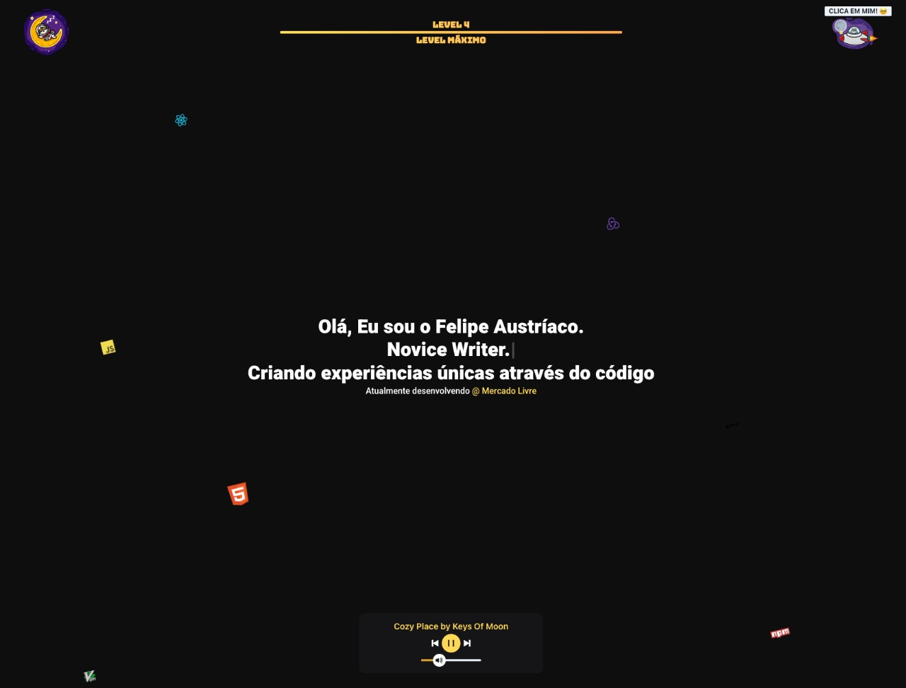

 
  

&#xa0;

<a href="https://felipeaustriaco.dev">Demo</a>

<h1 align="center">Portfolio V2</h1>

  

  

  

  

  

  <a href="#dart-about">About</a> &#xa0; | &#xa0; 
  <a href="#sparkles-features">Features</a> &#xa0; | &#xa0;
  <a href="#rocket-technologies">Technologies</a> &#xa0; | &#xa0;
  <a href="https://github.com/w1redl4in" target="_blank">Author</a>

 

## :dart: About

Meu portfolio gamificado com algumas informações pessoais, artigos e projetos.

## :sparkles: Features

:heavy_check_mark: Recompensa do Level 2: Tecnologias favoritas flutuando pela tela;\
:heavy_check_mark: Recompensa do Level 3: Libera novas áreas como Artigos e Projetos;\
:heavy_check_mark: Recompensa do Level 4: Libera um music player com playlist de lo-fi;

## :rocket: Technologies

The following tools were used in this project:

- [React](https://pt-br.reactjs.org/)
- [Next.js](https://nextjs.org/)
- [TypeScript](https://www.typescriptlang.org/)

## :memo: License

This project is under license from MIT. For more details, see the [LICENSE](LICENSE.md) file.

Made with :heart: by <a href="https://github.com/w1redl4in" target="_blank">Felipe Austríaco</a>

&#xa0;

<a href="#top">Back to top</a>
